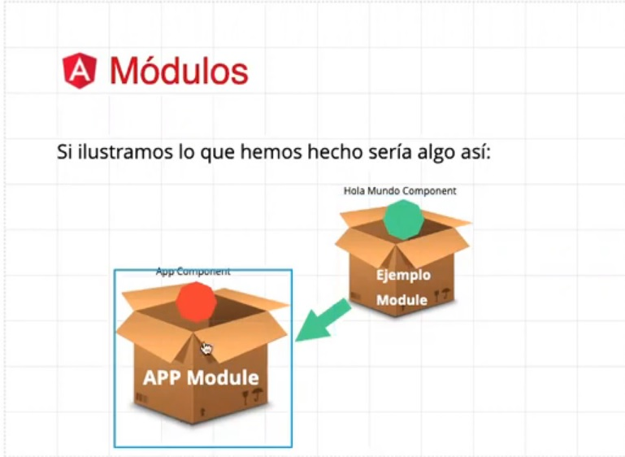

# 03 - Directivas y Módulos

## 0. Contenido

- Directivas
- Módulos

## 1. Módulos

Podemos entender los modulos como cajas que contienen componentes, y que al guardarlos en otras cajas mas grandes, estas cajas grandes y sus componentes pasan a tener acceso a los componentes guardados en al caja mas pequeña.
Los modulos nos permiten crear una arquitectura reutilizable para cualquier proyecto, ademas de brindarnos una gran capacidad de organizacion.

Hasta ahora vimos componentes vinculados a un único módulo en la app (`app.module.ts`), pero ¿qué pasaría si quisieramos declarar componentes vinculados a otro módulo, como por ejemplo, si quisieramos armar nuestras propias librerías?

En este caso, hay que recordar que el CLI de Angular no solo nos permite generar componentes, sino que, entre todas las opciones, nos permite tambien generar nuevos modulos.

Ej:

CLI:

```
ng module modules/Lists
```

Resultado:
Nos crea una carpeta `/modules` (si no existe con anterioridad) y nos ubica el modulo `lists` dentro de otra carpeta dentro de `/modules`

El contenido del modulo creado es por defecto el siguiente:

```javascript
// lists.module.ts
import { NgModule } from "@angular/core";
// El modulo personalizado es un modulo del tipo CommonModule de Angular, a diferencia del modulo base de la app
import { CommonModule } from "@angular/common";

@NgModule({
  declarations: [],
  imports: [CommonModule],
})
export class ListsModule {}
```

En este nuevo modulo podemos declarar componentes solo para este modulo y exportarlos para todos aquellos que lo utilicen.

Una vez creado este componente, se debe proceder a importarlo en los otros modulos donde se deberán utilizar los componentes que exporta el nuevo módulo personalizado, para que los demas modulos y los componentes declarados en ellos puedan utilizarlos.

Ej:

```javascript
// app.module.ts
import { NgModule } from "@angular/core";
import { BrowserModule } from "@angular/platform-browser";
import { FormsModule } from "@angular/forms";

import { AppComponent } from "./app.component";
import { SaludoComponent } from "./components/saludo/saludo.component";

// Módulo personalizado que exporta componentes de tipo Lista
import { ListsModule } from "./modules/lists/lists.module";

@NgModule({
  declarations: [AppComponent, SaludoComponent],
  imports: [
    BrowserModule,
    FormsModule,
    // Importamos el módulo personalizado
    ListsModule,
  ],
  providers: [],
  bootstrap: [AppComponent],
})
export class AppModule {}
```

Para declarar un componente en un modulo creado, es necesario indicar por la linea de comando la ruta del modulo al cual debe vincularse, de la siguiente manera:

```
ng g c modules/Lists/ListaBasica
```

En este caso, el componente ListaBasica se creará dentro de la carpeta `./app/modules/lists/lista-basica` y nos actualizará el modulo `lists.module.ts`, ya que se habrá vinculado a este.

```javascript
// lists.module.ts luego de crearse el componente
import { NgModule } from "@angular/core";
import { CommonModule } from "@angular/common";
import { ListaBasicaComponent } from "./lista-basica/lista-basica.component";

@NgModule({
  declarations: [ListaBasicaComponent],
  imports: [
    // El modulo personalizado es un modulo del tipo CommonModule de Angular, a diferencia del modulo base de la app
    CommonModule,
  ],
})
export class ListsModule {}
```

Luego de esto, necesitamos indicar aquellos componentes que queramos compartir, simplemente agregando una linea `exports: []` debajo de los imports del módulo, donde declaremos aquellos componentes que deben exportarse.

```javascript
@NgModule({
  declarations: [ListaBasicaComponent],
  imports: [
    CommonModule,
  ],
  exports: [
    // Exportamos aquellas clases (components / pipes, services, etc) que queramos compartir
    ListaBasicaComponent,
  ],
})
```

Una vez exportados los componentes del nuevo modulo, podemos importarlos en cualquier parte de la app, si es que los tenemos importados en el modulo general.



## 2. Directivas

En esta sección hablaremos de las directivas estructurales y las directivas de atributo.

### 2.a Directivas de Atributos

Las directivas de atributos sirven para modificar atributos concretos de los componentes, como pueden ser aplicar un estilo concreto (ngStyle o ngClass), o modificar alguna propiedad interna del componente (bindings como ngModel)

Estos ya los hemos visto previamente, y se encargan de aplicar modificaciones puntuales a ciertos elementos.

Ejemplos de Directivas de Atributos:

```javascript
<p [ngStyle]="{ color: 'tomato', fontWeight: 'bolder' }">Lista de Elementos</p>

<p ngClass="underlined">
  Aqui vamos a iterar sobre una lista y mostrar varios elementos
</p>

<p [ngClass]="['underlined', 'small']">Aún no tienes elementos en la lista</p>

<p [ngClass]="{ underlined: false, small: true }">
  Te recomendamos crear un elemento
</p>
```

### 2.b Directivas Estructurales

Las directivas estructurales se encargan de definir el renderizado de los elementos.

Estas directivas son muy utiles para generar contenido dinámico.

Las directivas estructurales se diferencian de las demas desde la misma declaración en la etiqueta HTML, ya que se declaran con un asterisco, a diferencia de las de Atributos, que se podian declarar solamente con texto o con corchetes o parentesis (o ambos), segun el caso.

Algunos ejemplos de las Directivas Estructurales son:

- \*ngIf="condicionDelIf": Renderiza un elemento según cierta condición planteada en el componente. Cuando la condición pasa de true a false, la etiqueta o el componente afectado por esta directiva pasa al ciclo de vida onDestroy.
  Ej:

  ```html
  <button (click)="cambiarCargando()">
    {{ cargando ? "Terminar Carga" : "Iniciar Carga" }}
  </button>

  <!-- ngIf -->
  <p *ngIf="cargando">Cargando...</p>
  ```

- \*ngIf/Else="condicionDelIf; else templateARenderizar": Chequea que se cumpla una condición y renderiza un elemento en una etiqueta ng-container. En caso de que no se cumpla la condición, renderiza otro elemento definido en una etiqueta ng-template con el nombre especificado.
  Ej:

  ```html
  <button (click)="cambiarCargando()">
    {{ cargando ? "Terminar Carga" : "Iniciar Carga" }}
  </button>
  <!-- ngIf/Else -->
  <!-- crea un contenedor ng que contiene la directiva if/else, y un template ng que se renderiza cuando la condición no se cumple -->

  <ng-container *ngIf="!cargando; else templateEspera">
    <p>¡Todo Listo!</p>
  </ng-container>

  <ng-template #templateEspera>
    <p>Cargando...</p>
    <p>Espere a que termine el proceso</p>
  </ng-template>
  ```

- \*ngFor="let elemento of arrayDeElementos": Permite renderizar una lista de elementos a partir de un array en el componente. Creamos una iteración que renderiza los elementos del array.
  Ej:

  ```html
  <!-- ngFor -->
  <!-- Dentro de las etiquetas que utilizan el ngFor, se renderizan los elementos indicados; en este caso, se renderiza un producto para cada elemento de la listaElementos que tenemos en el componente -->

  <div *ngFor="let producto of listaElementos; let i = index; let even = even">
    <div class="producto">
      <p>ID: {{i + 1}}</p>
      <p>{{ producto.nombre }} - {{ producto.precio }}€</p>
      <p>{{ producto.descripcion }}</p>
    </div>
  </div>
  ```

> En el ejemplo de arriba estamos indicando, ademas del array sobre le que iterar, el indice en la variable `i` y si el numero es par en la variable `even`; de esta manera podemos utilizar esta información para condicionar estilos o agregar información extra, dependiendo de estos valores. Otros valores a los que podemos acceder, ademas de `index` y `even` son `odd` (impares), `first` (primer elemento) y `last` (ultimo elemento).

- \*ngSwitch: Indica condiciones especificas que se deben cumplir para renderizar un contenido. Esta directiva es util cuando tenemos varias opciones para elegir.
  Ej:

  ```html
  <!-- Evaluamos el valor de la variable definida -->
  <div [ngSwitch]="opcion">
    <p [id]="1" *ngSwitchCase="1">Has escogido la Opcion 1</p>
    <p [id]="2" *ngSwitchCase="2">Has escogido la Opcion 2</p>
    <p [id]="3" *ngSwitchCase="3">Has escogido la Opcion 3</p>
    <p [id]="4" *ngSwitchCase="4">Has escogido la Opcion 4</p>
    <p *ngSwitchDefault class="cerrar"></p>
  </div>

  <!-- Seleccion de opcion para el usuario.
  La funcion escogerOpcion() esta declarada en el componente y se encarga de cambiar el valor de la variable "opcion" que se evalua en el switch de arriba -->
  <div>
    <input type="radio" name="opcion" (click)="escogerOpcion(1)" /> Opcion 1
    <input type="radio" name="opcion" (click)="escogerOpcion(2)" /> Opcion 2
    <input type="radio" name="opcion" (click)="escogerOpcion(3)" /> Opcion 3
    <input type="radio" name="opcion" (click)="escogerOpcion(4)" /> Opcion 4
    <input
      type="radio"
      selected="selected"
      name="opcion"
      (click)="escogerOpcion(0)"
    />
    Ocultar
  </div>
  ```

Las directivas se pueden concatenar, para aumentar la complejidad del renderizado dinamico.

Por ejemplo, con el codigo de abajo podemos hacer que el `*ngFor` renderice solo los productos cuyo precio es mayor a 10€, mediante el agregado de un `*ngIf` que indique esta condicion:

```html
<p>Productos de mas de 10€</p>
<div *ngFor="let producto of listaElementos; let i = index; let even = even">
  <!-- Renderiza solo los productos de precio mayor a 10€ -->
  <div
    *ngIf="producto.precio > 10"
    [ngStyle]="even ? {
        backgroundColor: 'blue',
        color: 'white',
        fontWeight: 'bold',
      } :
      {backgroundColor: 'green',
      color: 'white',
      fontWeight: 'bold',}"
  >
    <p>{{ producto.nombre }} - {{ producto.precio }}€</p>
    <p>{{ producto.descripcion }}</p>
  </div>
</div>
```
